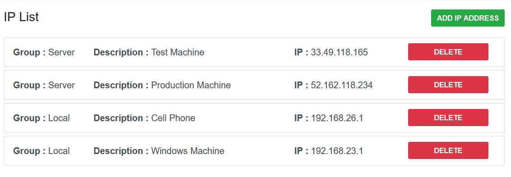

# Laravel IP Checker
[](https://packagist.org/packages/hayrican/ipchecker)
[](https://packagist.org/packages/hayrican/ipchecker)
[](//packagist.org/packages/hayrican/ipchecker)
[](https://scrutinizer-ci.com/g/HayriCan/laravel-ip-checker/?branch=master)
[](https://www.codacy.com/manual/HayriCan/laravel-ip-checker?utm_source=github.com&amp;utm_medium=referral&amp;utm_content=HayriCan/laravel-ip-checker&amp;utm_campaign=Badge_Grade)
[](https://scrutinizer-ci.com/g/HayriCan/laravel-ip-checker/build-status/master)
[](https://scrutinizer-ci.com/code-intelligence)
[](https://packagist.org/packages/hayrican/ipchecker)

This package provides restricted access by IP Address to your application.

## Installation
To get started, you should add the `hayrican/ipchecker` Composer dependency to your project:
```
composer require hayrican/ipchecker
```

#### Service Provider (Laravel Older 5.5)

##### If you are using later version of Laravel 5.5, you can skip this step.

Register provider on your `config/app.php` file.
```php
'providers' => [
    ...,
    HayriCan\IpChecker\IpCheckerServiceProvider::class,
]
```

## Configuration
You should publish vendor for configuration file.
```bash
$ php artisan vendor:publish --tag="ipchecker"
```

####Driver
The config file is called *ipchecker.php*. Currently supported drivers are `db` and `file`

Default driver is `file` and ipchecker will use file to record ip addresses. But if you want to use Database for records, migrate table by using

```bash
php artisan migrate
```
You have to change driver to `db` before migrate. Otherwise it will not migrate the table.

####Route Group Middleware
```php
'api_middleware'=>'api',
'web_middleware'=>'web',
```
If your routes has different middleware then these default values you can change them in here.
These route middleware need for filtering response of denial access.

####Denied Access Response
```php
'api_response'=>[
    'success'=>false,
    'code'=>250,
    'message'=>'Your IP Address not in the list.',
],

'web_response'=>'Your IP Address not in the list.',
```
Api response will be json so you can change response array from 'api_response',

Web response is a view and you can change it's message.

# Package Usage
## 1.Add Middleware
Add middleware named `ipchecker` to the route or controller you want to log data

```php
// in app.php or web.php

Route::group(['middleware' => ['ipchecker']], function () {
    Route::get('test',function (){
        dd('Test API');
    });
});
```
When try to access this route it will check your IP Address. If you ip address is not on the list you will get response
```php
{
    "success": false,
    "code": 250,
    "message": "Your IP Address not in the list."
}
``` 
Otherwise you will access to the route.

## 2.Add IP Address

Up to default config dashboard can be accessible via ***yourdomain.com/iplists*** but it is configurable from config file `ipchecker.php`

```php
{
 'settings'       => [
        'auth'       => false,
        'middleware' => [
            'web',
        ],
        "route_prefix"=> "",
    ],
}
``` 

If you want to guard this page just change 'auth' to `true` and it require 'auth' middleware. 
Also you can change the route prefix of this dashboard. If you change  'route_prefix' to `"foo"` your dashboard will be accessible via ***yourdomain.com/foo/iplists***.
 




You can add IP Address in here.

## Author

[Hayri Can BARÇIN]  
Email: [Contact Me]

## License

This project is licensed under the MIT License - see the [License File](LICENSE) for details


[//]: # (These are reference links used in the body of this note and get stripped out when the markdown processor does its job. There is no need to format nicely because it shouldn't be seen. Thanks SO - http://stackoverflow.com/questions/4823468/store-comments-in-markdown-syntax)
   [Hayri Can BARÇIN]: <https://www.linkedin.com/in/hayricanbarcin/>
   [Contact Me]: <mailto:hayricanbarcin@gmail.com>
